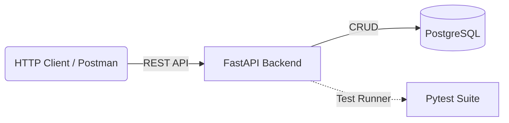

# Project Name: EcoOps - Intelligent Waste Management & Forecasting System

## 1. Executive Summary
**EcoOps** is a comprehensive platform designed to manage and optimize municipal waste collection. The project is executed in two distinct phases:
*   **v1 (Core API Platform)**: A high-performance, fully tested REST API handling all data operations. Built with **FastAPI**.
*   **v2 (Visual & Intelligence Layer)**: Adds the **Vue.js** frontend dashboard and the **Data Intelligence** (Airflow/ML) components.

---

## 2. Goals & Objectives
### Phase v1: The Core API
*   **Backend Excellence**: Develop a performant **FastAPI** backend with rigorous data validation and PostgreSQL storage.
*   **Reliability**: Achieve high test coverage using **Pytest** for unit and integration testing.
*   **Scalability**: Containerized design using Docker, ready for future service expansion.

### Phase v2: Visuals & Intelligence
*   **User Interface**: Create a responsive **Vue.js** frontend consuming the v1 API.
*   **Data Engineering**: Implement an **Apache Airflow** pipeline to ingest synthetic/historical data.
*   **Data Science**: Train time-series models (Prophet/Sklearn) to predict waste volume.

---

## 3. Technical Architecture

### 3.1 High-Level Diagram (v1 State)

---

## 4. Tech Stack
| Layer | Technology | v1 or v2? |
| :--- | :--- | :--- |
| **Backend** | FastAPI (Python) | **v1** |
| **Database** | PostgreSQL | **v1** |
| **Testing** | Pytest, HttpX | **v1** |
| **Containerization** | Docker & Docker Compose | **v1** |
| **Frontend** | Vue.js 3 (Vite) | **v2** |
| **Orchestration** | Apache Airflow | **v2** |
| **Machine Learning** | Scikit-learn / Prophet | **v2** |

---

## 5. Functional Requirements (v1)

### API Core
*   **Area Management**: CRUD operations for managing city districts/areas.
*   **Waste Logging**: Endpoints to record waste generation events (Weight, Type, Timeline).
*   **Validation**: Strict type checking and validation for all inputs (no negative weights, valid dates).
*   **Observability**: Health checks and basic stats endpoints.

---

## 6. Roadmap & Execution Plan

### Phase 1: v1 - Core API & Quality (Est. 6-8 Iterations)
1.  **Scaffolding**: Setup Backend, Docker Compose, and Testing infrastructure.
2.  **Domain Modeling**: SQLModel classes for `Area`, `WasteLog`.
3.  **API Implementation**: Modular routers for different resources.
4.  **Testing Harness**: Pytest fixtures for db session and client.
5.  **Test Coverage**: Writing tests for success paths, error handling, and edge cases.

### Phase 2: v2 - UI & Intelligence (Future)
1.  **Frontend**: Scaffolding Vue app to consume the V1 API.
2.  **DE/DS**: Airflow, Data Generation, and ML Model training.

---
**Next Steps**: Begin **Phase 1 (v1)** - Finalizing backend setup and dependencies.